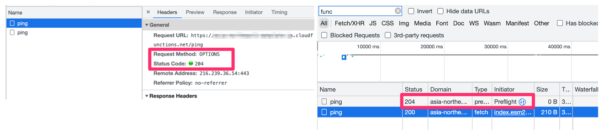

# BookReading-01 2023-03-04

## 読んだところ
- ３．Webセキュリティの基礎
  - 3-1. HTTPとセッション管理
    - クッキーによるセッション管理（P65 ここから）
  - 3-2. 受動的攻撃と同一オリジンポリシー
  - 3-3. CORS(Cross-Origin Resource Sharing)
- ４．Webアプリケーションの機能別に見るセキュリティバグ
  - 4-1. Webアプリケーションの機能と脆弱性の対応

## Note

### セッション管理機構とは（P67）

- httpはステートレスなので、毎回、誰がアクセスしているか、サーバ側ではわかりません。
「セッション管理機構」は、サーバ側にアクセスがある度にそのアクセスが誰からのアクセスなのかを特定する為の仕組みのことです。
- セキュリティのことを全く考えなくてよければ、クッキーにuser idを入れてそのアクセスをしているユーザを特定することができます（最も簡単な「セッション管理機構」）

### プリフライトリクエストって必要なんでしょうか？（P88）
- 徳丸さん動画（以下）が参考になります。

  - [今日こそ理解するCORS - プリフライトリクエストは本当に必要？](https://youtu.be/yBcnonX8Eak?t=674)

- ブラウザでcross originでpostのリクエストをするとoptionでプリフライトリクエストが走ります。同じapiを叩くときに2回requestが走ります。

## 次回
- 3/18（土）10:00 - 12:00
- P99 インジェクション系脆弱性とは から読みます
