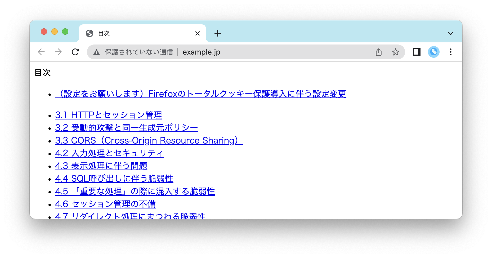

# 事前準備

読書会当日までに以下をお願いします。前日にやるとやりきれない可能性があるので、はやめにご準備ください。

- Dockerのインストール
- 実習用仮想マシンのダウンロード
- コンテナ起動
- OWASP ZAPのインストール（脆弱性診断ツール）
  - BurpSuiteに慣れているかたはそちらでも構いません

環境構築に躓いたら、お気軽に Slackまでご質問ください。答えられる範囲でお答えします。

当日の環境構築についての質問は、進行の妨げになるためお答えできません。ご承知おきください。

## Dockerのインストール

今回、本書に記載があるVirtualBoxは使用しません。
[安全なWebアプリケーションの作り方 第2版 サポートサイト](https://wasbook.org)で配布されているDockerを使用します。WindowsでもMacでも同じ環境で進められるので、こちらで環境構築をお願いいたします。

- [Docker](https://www.docker.com) からインストーラーをダウンロードし、インストールしてください。

Docker最新バージョンは「4.16.2 (95914)」です。

## 実習用仮想マシンのダウンロード

[実習用仮想マシン（Docker版 Ver 1.1.0 以上）](https://wasbook.org/download/wasbook-docker.zip) をダンロードしてください。

上記サイトには、ベーシック認証がついてます。IDとパスワードは、「[体系的に学ぶ 安全なWebアプリケーションの作り方 第2版 脆弱性が生まれる原理と対策の実践](https://amazon.co.jp/dp/4797393165/ref=nosim?tag=singularityso-22)」の 667ページに記載があります。

## コンテナの起動

こちらの「[コンテナ起動方法](https://wasbook.org/wasbook-docker.html) 」をご確認いただき、コンテナが起動するかご確認ください。

`docker compose up -d` で起動したコンテナは、`docker compose down` で停止できます。

## OWASP ZAPのインストール

[OWASP ZAPダウンロード](https://www.zaproxy.org/download/)からダウンロードし、インストールしてください。
Mac の場合、セキュリティの警告が出ることがあるので、System Settings > Privacy & Security から、OWASP ZAP の実行を許可してください。

### Windowsの人🤚

Windows は、JRE（Javaの実行環境）64bit版 が必要です。必要に応じてインストールしてください。

OWAS ZAPのインストーラーがエラーで起動しない場合は「[Windowsで OWAS ZAP のセットアップ](https://zenn.dev/singularity/articles/d9a555238061e9)」こちらの記事の内容を試してみてください。

## Proxyの設定

今回は、本書に記載のあるFireboxは使わず、Chrome を利用します。

### Macの設定方法

1. Chrome を起動し、アドレスバーに `chrome://settings/system` を入力します。
2. 「パソコンのプロキシ設定を開く」をクリックします。
3. プロキシ設定ウィンドウが開きます。「自動プロキシ構成」を `ON` にします。
4. URLに https://raw.githubusercontent.com/SingularitySociety/book_reading/main/2023Spring_DevelopingSecureWebApplications/proxy.pac を入力します。
5. 「OK」をクリックします。
6. http://example.jp/ にアクセスし、本書のコンテンツが表示されるか確認します。

### Windowsの設定方法

1. 「スタートメニュー」から「設定」を開きます。
2. 「ネットワークとインターネット」>「プロキシ」の順にクリックします。
3. プロキシ設定ウィンドウが開きます。「セットアップスクリプトを使う」を `ON` にします。
4. 「スクリプトのアドレス」に https://raw.githubusercontent.com/SingularitySociety/book_reading/main/2023Spring_DevelopingSecureWebApplications/proxy.pac を入力します。
5. 「保存」をクリックします。
6. http://example.jp/ にアクセスし、本書のコンテンツが表示されるか確認します。

### コンテンツが表示されない場合

- Dockerが起動しているか確認してください。
- ブラウザーのキャッシュを削除してみてください。
